# Topologieoptimierung von 2D-Federstrukturen (MBB-Beam)

Für das Abschlussprojekt in Softwaredesign wurde eine Anwendung mit Web-UI entwickelt, in der mechanische Strukturen definiert und eine Topologieoptimierung durchgeführt werden. Ziel war es, dieses am **MBB-Beam** zu testen.

Die Implementierung wurde am klassischen **MBB-Beam** getestet.

Dabei wurden alle folgenden Minimalanforderungen umgesetzt:

- Python-Anwendung mit Web-UI (Streamlit)
- Topologieoptimierung beliebiger 2D-Strukturen (unter definierten Modellannahmen)
- Frei definierbare Ausgangsstruktur
- Visualisierung der Struktur vor, während und nach der Optimierung inklusive Verformung
- Speichern und Laden der Struktur zu jedem Zeitpunkt
- Lösung des Problems in Anlehnung an die Finite-Elemente-Methode (FEM)
- Struktur darf nicht nicht "auseinander fallen" durch die Optimierung
- Testen der Implementierung am Beispiel des MBB Balken
- optimierte Geometrie als Graph herunterladbar
- [Deployed mit streamlit](google.com)

# Installation

```bash
git clone <https://github.com/wo1fsgier/Software_Design_Projekt.git>
cd Software_Design_Projekt
python -m venv .venv
.venv/Scripts/activate
pip install -r requirements.txt
streamlit run app.py
```

---

# Konzept

Die Struktur wird als diskretes Feder-Massen-System modelliert:

- Knoten = Massepunkte
- Kanten = lineare Federn
- Materialgesetz: Hooke (linear elastisch)
- Kleine Verformungen

Die Lösung erfolgt in Anlehnung an die Finite-Elemente-Methode (FEM):

1. Aufbau der globalen Steifigkeitsmatrix  
2. Lösung des Gleichungssystems  
3. Berechnung der Verformungsenergie  
4. Iteratives Entfernen energetisch irrelevanter Knoten  

---


# Optimierungsalgorithmus

Die Optimierung läuft iterativ:

1. Lösung des Gleichungssystems
2. Berechnung der Knoten-Signifikanz (Energiebeitrag)
3. Sortierung nach Energie
4. Entfernen mehrerer Knoten pro Iteration
5. Connectivity-Check (Graph darf nicht auseinanderfallen)
6. Abbruch bei Erreichen des Zielanteils

Wichtige Eigenschaften:

- Es werden Knoten entfernt
- Pro Iteration werden mehrere Knoten gelöscht
- Struktur wird nur akzeptiert, wenn sie zusammenhängend bleibt

---
# UML Diagramm

# Projektstruktur

```
SOFTWARE_DESIGN_PROJEKT
│
├── app.py                     # Streamlit UI
├── StrukturPlot.py            # Visualisierung
│
├── Berechnungen
│   ├── Solver.py              # Aufbau & Lösung K_g u = F
│   ├── Optimizer.py           # Topologieoptimierung
│   └── Solver_Vorlage.py
│
├── Datenstrukturen
│   ├── Struktur.py            # Gesamtstruktur
│   ├── StrukturBuilder.py     # Aufbau Rechteckmodell
│   ├── Feder.py               # Federobjekt
│   ├── Knoten.py              # Massenpunkt
│
└── README.md
```

# Testfall: MBB-Beam

Standardkonfiguration:

- Links unten: Loslager
- Rechts unten: Festlager
- Kraft: Vertikal am oberen Mittelpunkt


---

# Technische Highlights

- Globale Steifigkeitsmatrix über Superposition
- Graph-basierter Connectivity-Check (DFS)
- Iteratives Entfernen mit Backup/Restore-Mechanismus
- Live-Visualisierung während Optimierung

- Modularer Aufbau (Solver, Optimizer, Datenstruktur getrennt)

---

# Nutzung von KI

Im Rahmen der Entwicklung wurde ChatGPT unterstützend eingesetzt.

Die Nutzung beschränkte sich auf:

- Unterstützung beim Debugging und beim Verständnis von Fehlermeldungen  
- Klärung am Anfang um dieses Modell zu verstehen 
- Struktur vom README  
